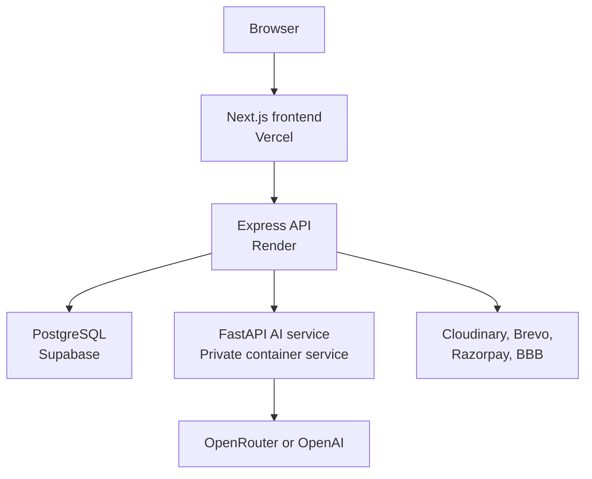

# School & College ERP/LMS

A multi-tenant education management platform that brings institution administration, learning workflows, role-based portals, and AI-assisted tools into one system. It is designed for schools and colleges and can be adapted to different academic structures.

## Demo access

The demo workspace uses fictional data created for portfolio review.

| Field | Demo value |
| --- | --- |
| Application | `http://localhost:3000/admin/login` |
| Institution | Green Valley School |
| School / College Code | `GVS001` |
| Portal | Admin |
| Login ID | `demo.admin@greenvalley-erp.test` |
| Password | `Demo@GVS2026` |

## Features

| Area | Capabilities |
| --- | --- |
| Institution management | Multi-tenant school and college registration, branding, academic sessions, departments, classes, sections, and subjects |
| Users and access | User-first student, teacher, and parent sign-in; separate administration login; verified Google sign-in for existing non-admin accounts; tenant-aware role authorization |
| Academics | Attendance, homework, timetables, examinations, marks, report cards, and reports |
| Learning management | Courses, lessons, enrollment, progress, assignments, submissions, quizzes, and summaries |
| Finance | Fee structures, balances, payments, expenses, and optional Razorpay integration |
| Communication | Notices, announcements, events, complaints, notifications, OTP, and password recovery |
| Resources | Library circulation, file uploads, and optional BigBlueButton meetings |
| AI assistance | Curriculum generation, notice drafting, lesson summaries, quizzes, and lesson chat |

## Technology stack

| Layer | Technology |
| --- | --- |
| Frontend | Next.js, React, TypeScript, Tailwind CSS |
| Public API | Express 5, TypeScript, Zod |
| AI service | FastAPI, Python |
| Database | PostgreSQL |
| Cache | Redis, optional |
| Authentication | Password login, Google OAuth 2.0 with PKCE, JWT access tokens, and rotating refresh tokens |
| Infrastructure | Docker Compose, Render, Vercel, Supabase |
| Integrations | Cloudinary, Brevo SMTP, Razorpay, BigBlueButton, Telegram, OpenRouter/OpenAI |

## Architecture



Express is the only public backend. FastAPI runs privately at `http://127.0.0.1:8001` inside the combined Render container and is called internally by Express.

## Supported institutions

The registration flow supports both `school` and `college` institution types. Shared modules such as departments, academic sessions, classes, sections, subjects, students, teachers, attendance, examinations, fees, courses, communication, and library operations can be configured for either type.

Some internal tables, API paths, role constants, and interface labels still use legacy names such as `schools`, `school_id`, `SCHOOL_ADMIN`, and “School Profile.” These are implementation names and do not prevent college registration.

The current scope does not include university-specific workflows such as faculties, credit systems, or semester transcripts.

## Authentication and portal entry

| Route | Intended users | Sign-in methods |
| --- | --- | --- |
| `/login` | Students, teachers, and parents | Registered login ID and password, or Google using the registered email |
| `/admin/login` | School owners and administrators | Registered login ID and password |

The backend determines the role after authentication. The interface does not let a user select or promote their own role.

Google sign-in never creates an ERP account. The institution must create the student, teacher, or parent account first, and its registered email must exactly match a verified Google email. The first successful sign-in securely links the Google identity to that existing account. Administrator roles remain password-only in this version.

The login page also checks `/health` as soon as it opens. When the free Render service is sleeping, a non-blocking message explains the delay and the requested password or Google sign-in continues automatically when the backend becomes available.

## Repository structure

```text
.
├── frontend/       # Next.js role-based web application
├── server/         # Express and TypeScript public API
├── ai-service/     # Private FastAPI AI microservice
├── Dockerfile.free # Combined free-tier backend container
├── docker-compose.yml
└── render.yaml
```

Detailed backend structure and route mapping are available in [`server/FULL_BACKEND_STRUCTURE.md`](server/FULL_BACKEND_STRUCTURE.md).

## Local development

### Environment files

```bash
cp server/.env.example server/.env
cp ai-service/.env.example ai-service/.env
cp frontend/.env.local.example frontend/.env.local
```

On Windows PowerShell:

```powershell
Copy-Item server/.env.example server/.env
Copy-Item ai-service/.env.example ai-service/.env
Copy-Item frontend/.env.local.example frontend/.env.local
```

Use different random values for `JWT_SECRET` and `AI_SERVICE_TOKEN`. The `AI_SERVICE_TOKEN` value must match between Express and FastAPI.

### Start the backend

```bash
docker compose up --build
```

### Start the frontend

```bash
cd frontend
npm ci
npm run dev
```

Open `http://localhost:3000`. The local API runs at `http://localhost:8000`. Keep the same hostname in `NEXT_PUBLIC_API_BASE_URL` and `GOOGLE_CALLBACK_URL` so the temporary OAuth cookie is returned correctly.

## Database migrations

Database migrations are stored in `server/migrations/`. The combined Render container runs unapplied migrations before starting Express, while applied filenames are recorded in `schema_migrations`.

Future database changes should use the next ordered migration filename:

```text
server/migrations/004_feature_name.sql
```

Existing migrations that have already been applied to a shared database should not be renamed, deleted, or rewritten.

## Deployment configuration

| Component | URL |
| --- | --- |
| Frontend | `https://your-authorized-frontend.example` |
| Backend | `https://your-authorized-api.example` |
| Health check | `https://your-authorized-api.example/health` |
| Readiness check | `https://your-authorized-api.example/ready` |

### Vercel

```env
NEXT_PUBLIC_API_BASE_URL=https://your-authorized-api.example
NEXT_PUBLIC_BACKEND_WAKEUP_UI=true
```

### Render

```env
CORS_ORIGINS=https://your-authorized-frontend.example
FRONTEND_URL=https://your-authorized-frontend.example
PUBLIC_API_URL=https://your-authorized-api.example
AI_SERVICE_URL=http://127.0.0.1:8001
GOOGLE_CLIENT_ID=your-google-web-client-id
GOOGLE_CLIENT_SECRET=your-google-web-client-secret
GOOGLE_CALLBACK_URL=https://your-authorized-api.example/auth/google/callback
```

Create a Google OAuth client with application type **Web application**. Add the exact backend callback URL shown above as an authorized redirect URI. For local testing, also add `http://localhost:8000/auth/google/callback`. Keep the client secret only in the backend environment; never add it to Vercel or a `NEXT_PUBLIC_*` variable.

Set `NEXT_PUBLIC_BACKEND_WAKEUP_UI=false` after moving the API to an always-on host if the beta cold-start message is no longer needed.

When `NEXT_PUBLIC_API_BASE_URL` is not set, the frontend falls back to `http://localhost:8000` for local development.

## Validation

### Express API

```bash
cd server
npm ci
npm run typecheck
npm test
npm run build
```

### Next.js frontend

```bash
cd frontend
npm ci
npm run lint
npm run build
```

### FastAPI service

```bash
cd ai-service
python -m compileall -q app
```

## Deployment notes

- Set `EMAIL_OTP_DEBUG=false` in production.
- Use Cloudinary for persistent uploads because Render's free filesystem is ephemeral.
- Keep `REDIS_REQUIRED=false` when Redis is unavailable.
- Leave `BBB_URL` and `BBB_SECRET` empty when BigBlueButton is not configured.
- Keep `.env` files, database credentials, SMTP passwords, API keys, and access tokens out of version control.
- The free-tier configuration is intended for demonstrations, not real student data without a complete security, privacy, backup, and monitoring review.

## Project background

The original education ERP project was developed collaboratively while I worked with **Finsocial Digital System**. Frontend and backend responsibilities were shared with one teammate, and the original AI functionality was developed by a separate AI team.

My work on the original team project included:

- Frontend and backend development for ERP workflows.
- User interface and backend API implementation.
- Telegram-related integration and Gmail/email communication workflows.
- Debugging, integration, and application delivery.

For this personal portfolio version, I later:

- Migrated the core ERP/public API layer from FastAPI and Python to Express 5 and TypeScript.
- Reorganized CRUD operations into models, repositories, services, controllers, validators, and routes.
- Retained FastAPI as a private AI microservice called internally by Express.
- Adapted database migrations, deployment configuration, health checks, and free-tier hosting support.

This project is presented as collaborative work and does not claim sole authorship of the original product or of AI work created by the separate AI team.

## Publication and ownership

This is a personal portfolio adaptation, not an official Finsocial Digital System repository, product release, or company-maintained deployment. The company name is included only to describe the project's origin and does not imply endorsement.

Public distribution or deployment is subject to written authorization from the relevant rights holder. No open-source licence is granted by this repository, and rights in the original company and team-developed material remain with their respective owners.
