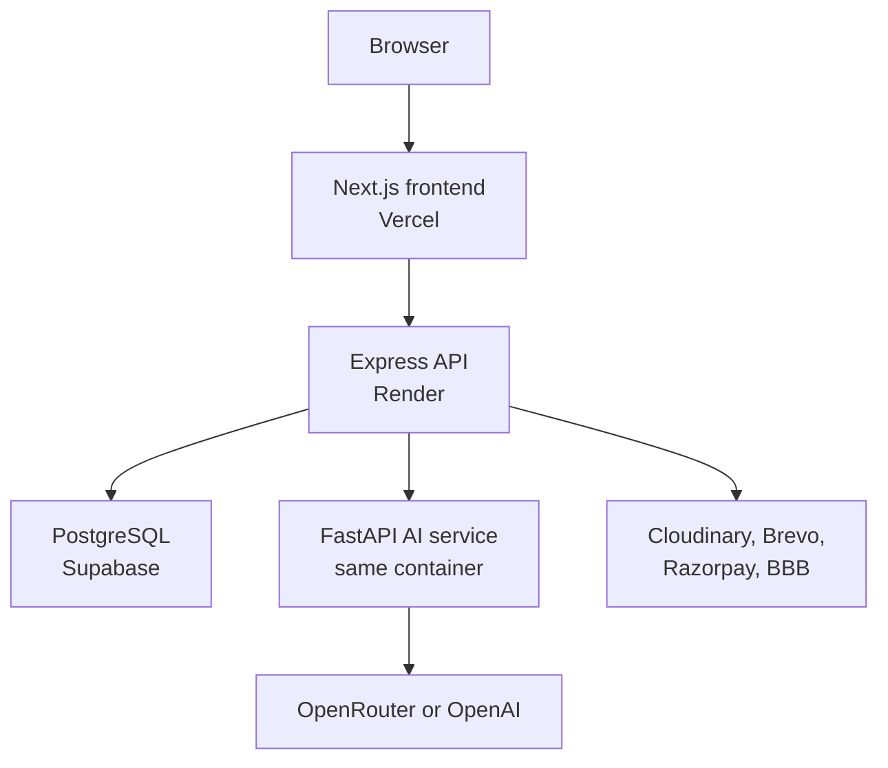

# School & College ERP/LMS — Personal Portfolio Adaptation

An unofficial personal portfolio adaptation of a multi-tenant education management platform for schools and colleges. It combines ERP operations, learning management, role-based portals, and AI-assisted content tools.

> Public repository and deployment links should be added only after written publication authorization has been obtained from the relevant rights holder.

## Project origin, attribution, and contribution record

The original education ERP project was developed collaboratively during my work with **Finsocial Digital System**. It was a team project and was not created by me alone.

### My contributions to the original team project

- Worked across both frontend and backend development with one teammate.
- Implemented and maintained ERP user interfaces and backend API workflows.
- Worked on Telegram-related integration and Gmail/email communication workflows.
- Participated in debugging, integration, and delivery of the application as part of the development team.

### Contributions by others

- Frontend and backend responsibilities were shared with my teammate; this repository does not claim sole authorship of that work.
- The original AI functionality and its integration with the FastAPI backend were developed by a separate AI team.
- I do not claim authorship of AI models, prompts, provider logic, or AI integration work created by that team, except for any later changes I personally made and can identify from version history.

### Changes made for this personal portfolio version

After the original collaborative work, I adapted the architecture for this personal version:

- Migrated the core ERP/public API layer from FastAPI/Python to Express 5 and TypeScript.
- Reorganized standard CRUD operations into TypeScript models, repositories, services, controllers, validators, and routes.
- Retained FastAPI only as a private AI microservice called internally by Express.
- Adapted database migrations, deployment configuration, health checks, and free-tier hosting support.
- These later changes do not make me the sole author or owner of the original team-developed product.

## Publication and ownership notice

This repository is not an official Finsocial Digital System repository, product release, or company-maintained deployment. Use of the company name here is solely to provide truthful project provenance and employment context; it does not imply sponsorship or endorsement.

This attribution notice is **not** a copyright licence and does not itself authorize publication of employer-owned or teammate-owned source code. Until written authorization for public distribution has been obtained from the relevant rights holder, this repository and any deployment made from it should remain private.

Before any authorized public release, the repository must be sanitized to remove company credentials, confidential information, client or student data, internal documents, proprietary assets, and any code that the rights holder has not approved for publication. Teammates should be named only with their consent.

No open-source licence is granted by this README. Rights in original company/team-developed material remain with their respective rights holders. Do not add an MIT or other open-source licence unless the appropriate owner has authorized it in writing.

## Supported institution types

The registration flow explicitly supports both `school` and `college` institution types, and the selected value is stored with each tenant. Shared modules—including departments, academic sessions, classes, sections, subjects, students, teachers, attendance, examinations, fees, courses, communication, and library operations—can be configured for either type.

Some internal database tables, API paths, role constants, and interface labels retain legacy names such as `schools`, `school_id`, `SCHOOL_ADMIN`, and “School Profile.” These are implementation names and do not prevent college registration, but the terminology has not yet been fully generalized. This repository therefore claims support for **schools and colleges**, not universities or university-specific workflows such as faculties, degree programmes, credit systems, and semester transcripts.

## Features

| Area | Capabilities |
| --- | --- |
| Institution management | Multi-tenant school/college registration, branding, sessions, departments, classes, sections, and subjects |
| Users and access | School admin, teacher, student, and parent portals with tenant-aware role authorization |
| Academics | Attendance, homework, timetable, exams, marks, report cards, and reports |
| LMS | Courses, lessons, enrollment, progress, assignments, submissions, quizzes, and summaries |
| Finance | Fee structures, balances, payments, expenses, and optional Razorpay integration |
| Communication | Notices, announcements, events, complaints, notifications, OTP, and password recovery |
| Resources | Library circulation, persistent uploads, and optional BigBlueButton meetings |
| AI | Curriculum generation, notice drafting, lesson summaries, quizzes, and lesson chat |

## Architecture



Express is the only public backend. FastAPI remains private at `http://127.0.0.1:8001` inside the same Render container.

## Deployment configuration

| Component | URL |
| --- | --- |
| Frontend | `https://your-authorized-frontend.example` |
| Backend | `https://your-authorized-api.example` |
| Health | `https://your-authorized-api.example/health` |
| Readiness | `https://your-authorized-api.example/ready` |

Production URLs belong in hosting environment variables—not in the frontend runtime fallback:

```env
# Vercel
NEXT_PUBLIC_API_BASE_URL=https://your-authorized-api.example
```

```env
# Render
CORS_ORIGINS=https://your-authorized-frontend.example
FRONTEND_URL=https://your-authorized-frontend.example
PUBLIC_API_URL=https://your-authorized-api.example
AI_SERVICE_URL=http://127.0.0.1:8001
```

The frontend source intentionally falls back to `http://127.0.0.1:8000` when `NEXT_PUBLIC_API_BASE_URL` is absent. Therefore, local development never calls the production API accidentally.

After publication has been authorized, replace the placeholder domains with the approved deployment URLs.

## Local development

Copy the local templates:

```bash
cp server/.env.example server/.env
cp ai-service/.env.example ai-service/.env
cp frontend/.env.local.example frontend/.env.local
```

On Windows PowerShell, use `Copy-Item` instead of `cp`.

Generate different random values for `JWT_SECRET` and `AI_SERVICE_TOKEN`. The `AI_SERVICE_TOKEN` value must match between Express and FastAPI.

Start the complete backend stack:

```bash
docker compose up --build
```

Start the frontend in another terminal:

```bash
cd frontend
npm ci
npm run dev
```

Open `http://localhost:3000`; the local API is `http://127.0.0.1:8000`.

## Database migrations

Keep every file in `server/migrations/`. The combined Render container runs unapplied migrations automatically before starting Express. Applied filenames are stored in `schema_migrations` and skipped on future starts.

For future database changes, add the next ordered file, such as:

```text
server/migrations/003_feature_name.sql
```

Do not delete, rename, or rewrite migrations already applied to a shared database.

## Validation

```bash
cd server
npm ci
npm run typecheck
npm test
npm run build

cd ../frontend
npm ci
npm run lint
npm run build

cd ../ai-service
python -m compileall -q app
```

## Important production notes

- Set `EMAIL_OTP_DEBUG=false` in production.
- Use Brevo SMTP port `2525` on Render Free.
- Use Cloudinary because Render's free filesystem is ephemeral.
- Leave `REDIS_REQUIRED=false` when Redis is unavailable.
- Leave `BBB_URL` and `BBB_SECRET` unset without an authorized BigBlueButton server.
- Never commit `.env` files, database passwords, SMTP keys, or API keys.
- This free deployment is suitable for demonstrations, not real student data without a full security, privacy, backup, and monitoring review.

The backend layer and route mapping is documented in [server/FULL_BACKEND_STRUCTURE.md](server/FULL_BACKEND_STRUCTURE.md).  