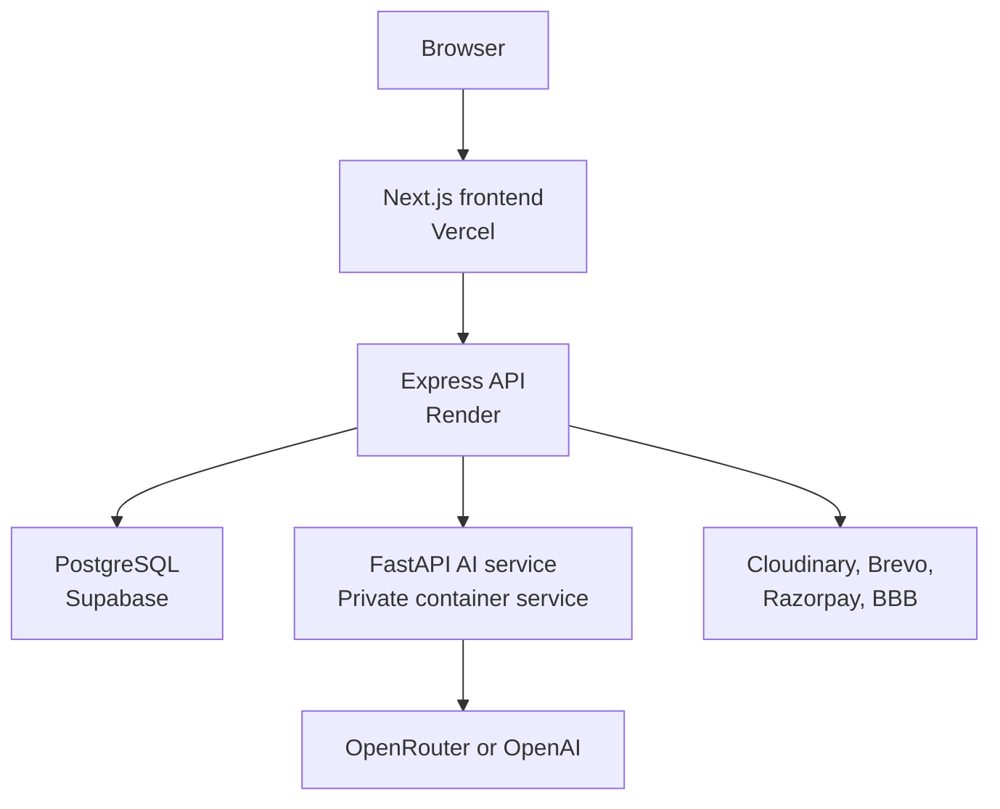

# School & College ERP/LMS — Personal Portfolio Adaptation

An unofficial personal portfolio adaptation of a multi-tenant education management platform for schools and colleges. It combines ERP operations, learning management, role-based portals, and AI-assisted content tools.

> [!IMPORTANT]
> This repository is not an official Finsocial Digital System release. It should remain private, and deployment links or public credentials should not be published, until written publication authorization has been obtained from the relevant rights holder.

## Demo access

The following credentials are intended only for an isolated portfolio/demo database containing fictional data. A fresh clone does **not** create this account automatically; create and verify the account in the database used by the demo before sharing these credentials.

| Field | Demo value |
| --- | --- |
| Frontend | `http://localhost:3000` |
| Institution | Green Valley School |
| School / College Code | `GVS001` |
| Portal | Admin |
| Login ID | `demo.admin@greenvalley-erp.test` |
| Password | `Demo@GVS2026` |

For an authorized public deployment, replace the local `.test` login with a dedicated, verified demo inbox and test the credentials in a private/incognito browser before updating this table. Never publish a personal email, reused password, production owner account, or credentials connected to real institution data.

> [!WARNING]
> The current admin permission model allows write operations. Before exposing an admin login publicly, use a dedicated demo database and either block destructive/password-changing actions for the demo account or reset the demo data automatically. The README cannot provision or protect an account by itself.

## Screenshots

Store screenshots inside `docs/screenshots/` so GitHub can load them through relative paths. Recommended filenames are:

```text
docs/screenshots/
├── login.png
├── admin-dashboard.png
├── academic-setup.png
└── timetable.png
```

After the files exist, add them with Markdown:

```md

```

For two screenshots in one row, GitHub also supports basic HTML:

```html
<p align="center">
  
  
</p>
```

Use lowercase filenames without spaces, remove real names/emails from screenshots, and do not add image links until the matching files have been committed. This prevents broken images in the README.

## Features

| Area | Capabilities |
| --- | --- |
| Institution management | Multi-tenant school/college registration, branding, sessions, departments, classes, sections, and subjects |
| Users and access | Admin, teacher, student, and parent portals with tenant-aware role authorization |
| Academics | Attendance, homework, timetable, examinations, marks, report cards, and reports |
| LMS | Courses, lessons, enrollment, progress, assignments, submissions, quizzes, and summaries |
| Finance | Fee structures, balances, payments, expenses, and optional Razorpay integration |
| Communication | Notices, announcements, events, complaints, notifications, OTP, and password recovery |
| Resources | Library circulation, persistent uploads, and optional BigBlueButton meetings |
| AI assistance | Curriculum generation, notice drafting, lesson summaries, quizzes, and lesson chat |

## Architecture



Express is the only public backend. FastAPI remains private at `http://127.0.0.1:8001` inside the combined Render container.

## Technology stack

| Layer | Technology |
| --- | --- |
| Frontend | Next.js, React, TypeScript, Tailwind CSS |
| Public backend | Express 5, TypeScript, Zod |
| AI service | FastAPI, Python |
| Data | PostgreSQL, optional Redis |
| Authentication | JWT access tokens and rotating refresh tokens |
| Infrastructure | Docker Compose, Render, Vercel, Supabase |
| Optional integrations | Cloudinary, Brevo SMTP, Razorpay, BigBlueButton, Telegram, OpenRouter/OpenAI |

## Supported institution types

The registration flow explicitly supports both `school` and `college` institution types, and the selected value is stored with each tenant. Shared modules—including departments, academic sessions, classes, sections, subjects, students, teachers, attendance, examinations, fees, courses, communication, and library operations—can be configured for either type.

Some database tables, API paths, role constants, and interface labels retain legacy names such as `schools`, `school_id`, `SCHOOL_ADMIN`, and “School Profile.” These implementation names do not prevent college registration, but the terminology has not yet been fully generalized.

The current scope therefore claims support for schools and colleges, not university-specific workflows such as faculties, degree programmes, credit systems, or semester transcripts.

## Project origin, attribution, and contribution record

The original education ERP project was developed collaboratively during my work with **Finsocial Digital System**. It was a team project and was not created by me alone.

### My contributions to the original team project

- Worked across frontend and backend development with one teammate.
- Implemented and maintained ERP user interfaces and backend API workflows.
- Worked on Telegram-related integration and Gmail/email communication workflows.
- Participated in debugging, integration, and application delivery as part of the development team.

### Contributions by others

- Frontend and backend responsibilities were shared with my teammate; this repository does not claim sole authorship of that work.
- The original AI functionality and its integration with the FastAPI backend were developed by a separate AI team.
- I do not claim authorship of AI models, prompts, provider logic, or AI integration work created by that team, except for later changes I personally made and can identify from version history.

### Changes made for this personal portfolio version

After the original collaborative work, I adapted the architecture for this personal version:

- Migrated the core ERP/public API layer from FastAPI/Python to Express 5 and TypeScript.
- Reorganized standard CRUD operations into TypeScript models, repositories, services, controllers, validators, and routes.
- Retained FastAPI only as a private AI microservice called internally by Express.
- Adapted database migrations, deployment configuration, health checks, and free-tier hosting support.
- These later changes do not make me the sole author or owner of the original team-developed product.

## Repository structure

```text
.
├── frontend/       # Next.js role-based web application
├── server/         # Express 5 and TypeScript public API
├── ai-service/     # Private FastAPI AI microservice
├── Dockerfile.free # Combined free-tier backend container
├── docker-compose.yml
└── render.yaml
```

The backend layer and route mapping are documented in [`server/FULL_BACKEND_STRUCTURE.md`](server/FULL_BACKEND_STRUCTURE.md).

## Local development

### 1. Create local environment files

```bash
cp server/.env.example server/.env
cp ai-service/.env.example ai-service/.env
cp frontend/.env.local.example frontend/.env.local
```

On Windows PowerShell, use:

```powershell
Copy-Item server/.env.example server/.env
Copy-Item ai-service/.env.example ai-service/.env
Copy-Item frontend/.env.local.example frontend/.env.local
```

Generate different random values for `JWT_SECRET` and `AI_SERVICE_TOKEN`. The `AI_SERVICE_TOKEN` value must match between Express and FastAPI.

### 2. Start the backend stack

```bash
docker compose up --build
```

### 3. Start the frontend

```bash
cd frontend
npm ci
npm run dev
```

Open `http://localhost:3000`. The local API is available at `http://127.0.0.1:8000`.

### 4. Create the local demo institution

With `EMAIL_OTP_DEBUG=true` in local development only, register the fictional Green Valley School account using code `GVS001`, login ID `demo.admin@greenvalley-erp.test`, and password `Demo@GVS2026`. Complete the OTP shown by the development registration flow, then populate the demo database with fictional departments, classes, subjects, teachers, and students.

Do not enable OTP debug mode in a public environment.

## Database migrations

Keep every migration in `server/migrations/`. The combined Render container runs unapplied migrations before starting Express. Applied filenames are recorded in `schema_migrations` and skipped on later starts.

For future database changes, add the next ordered file, for example:

```text
server/migrations/003_feature_name.sql
```

Do not delete, rename, or rewrite migrations already applied to a shared database.

## Deployment configuration

Public URLs must remain placeholders until publication and deployment have been authorized.

| Component | URL |
| --- | --- |
| Frontend | `https://your-authorized-frontend.example` |
| Backend | `https://your-authorized-api.example` |
| Health | `https://your-authorized-api.example/health` |
| Readiness | `https://your-authorized-api.example/ready` |

Production URLs belong in hosting environment variables, not in frontend runtime fallbacks.

### Vercel

```env
NEXT_PUBLIC_API_BASE_URL=https://your-authorized-api.example
```

### Render

```env
CORS_ORIGINS=https://your-authorized-frontend.example
FRONTEND_URL=https://your-authorized-frontend.example
PUBLIC_API_URL=https://your-authorized-api.example
AI_SERVICE_URL=http://127.0.0.1:8001
```

The frontend intentionally falls back to `http://127.0.0.1:8000` when `NEXT_PUBLIC_API_BASE_URL` is absent, preventing local development from calling the production API accidentally.

After publication is authorized, replace the placeholder domains with the approved deployment URLs.

## Validation

### Express API

```bash
cd server
npm ci
npm run typecheck
npm test
npm run build
```

### Next.js frontend

```bash
cd frontend
npm ci
npm run lint
npm run build
```

### FastAPI service

```bash
cd ai-service
python -m compileall -q app
```

## Production and demo safety checklist

- Obtain written publication authorization before making the repository or deployment public.
- Change `EMAIL_OTP_DEBUG` to `false` in production. The current `render.yaml` value must also be changed before public deployment.
- Use a dedicated demo database containing only fictional data.
- Do not expose a real `SCHOOL_OWNER` account or personal email address.
- Restrict password changes, branding/settings changes, and destructive operations for any publicly shared demo account, or restore the database on a schedule.
- Use Brevo SMTP port `2525` on Render Free where supported by the selected service configuration.
- Use Cloudinary because Render's free filesystem is ephemeral.
- Leave `REDIS_REQUIRED=false` when Redis is unavailable.
- Leave `BBB_URL` and `BBB_SECRET` unset without an authorized BigBlueButton server.
- Never commit `.env` files, database passwords, SMTP credentials, API keys, or access tokens.
- Treat free-tier deployment as a portfolio demonstration, not as production infrastructure for real student data without a full security, privacy, backup, and monitoring review.

## Publication and ownership notice

This repository is not an official Finsocial Digital System repository, product release, or company-maintained deployment. Use of the company name is solely to provide truthful project provenance and employment context; it does not imply sponsorship or endorsement.

This attribution notice is not a copyright licence and does not itself authorize publication of employer-owned or teammate-owned source code. Until written authorization for public distribution has been obtained from the relevant rights holder, this repository and any deployment made from it should remain private.

Before an authorized public release, sanitize the repository to remove company credentials, confidential information, client or student data, internal documents, proprietary assets, and any code the rights holder has not approved for publication. Name teammates only with their consent.

No open-source licence is granted by this README. Rights in original company/team-developed material remain with their respective rights holders. Do not add an MIT or other open-source licence unless the appropriate owner has authorized it in writing.